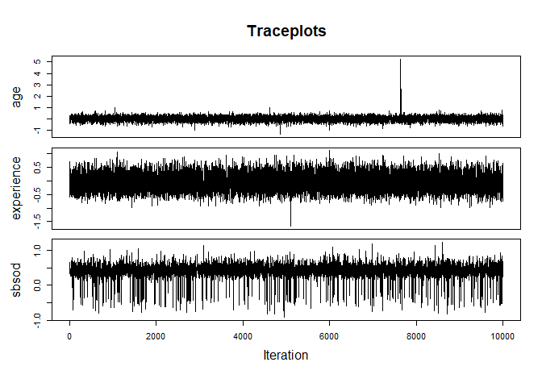
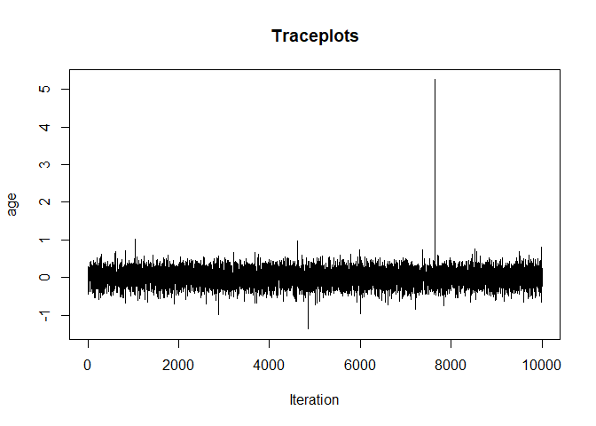

---
affiliations:
- index: 1
  name: |
      Section of Biostatistics, Department of Public Health, University of
      Copenhagen
authors:
- affiliation: 1
  name: Jolien Cremers
  orcid: '0000-0002-0037-1747'
bibliography: 'paper.bib'
date: '24/02/2020'
output:
  md_document:
    pandoc_args: '--atx-headers'
    preserve_yaml: True
    variant: markdown
  pdf_document: default
tags:
- R
- Bayesian statistics
- Circular data
- Regression
- 'Mixed-effects models'
title: |
    bpnreg: A package to analyze Bayesian projected normal circular
    regression and mixed-effects models
---

# Summary

The analysis of circular data, measured in degrees or radians, is
inherently different from standard linear data due to its periodic
nature ($0^\circ = 360^\circ$). Special methods are needed, even for
computing basic summary statistics [@mardia2009directional]. Although
circular data is not very common they occur in a diverse range of
research areas, astronomy, medicine, genetics, neurology,
environmetrics, psychology and geology among others. Software
implementations for the analysis of regression type models for circular
data are however scarce. To date `bpnreg` is the only software package
that implements methods to analyze both regression and mixed-effects
models for circular outcomes.

# Statement of Need

The purpose of `bpnreg` is to provide methods for fitting circular
regression and mixed-effects models to `R`-users. Its two main functions
allow for fitting Bayesian multiple and mixed-effects regression models
for circular data based on the projected normal distribution (see
@Nunez-Antonio2011-fm and @Nunez-Antonio2014-bd for a description of the
models). Both continuous and categorical predictors can be included.
Sampling from the posterior is performed via an MCMC algorithm
implemented in `c++` that allows for fast computation (see
@Cremers2018-ta and @Cremers2021-mm for a description and assessment of
the MCMC samplers). Posterior descriptives of all parameters, model fit
statistics and Bayes factors for hypothesis tests for inequality
constrained hypotheses are provided.

There are several R-packages that provide methods for circular data
analyses, but only a couple contain functionality for circular
regression models (see @pewsey2020recent for an overview). The package
`circular` [@Agostinelli2017] is a general purpose package that also
contains functionality for fitting frequentist regression models for
circular outcomes based on the von Mises distribution. The package
`circglmbayes` [@Mulder2017] provides a Bayesian regression model for
circular outcomes based on the von Mises distribution. To date however,
`bpnreg` is the only R-package providing Bayesian multiple regression as
well as mixed-effects models for circular outcomes based on the
projected normal distribution.

From its first release `bpnreg` has been used for circular data analysis
in several publications
[@Tyson-Carr2020-mu; @Cremers2021-mm; @Cote2020-xg; @Rafferty2020-pb; @Ojeda_undated-by; @Olson2020-al; @Klugkist2018-ag; @Spinks2019-ya].

# Use

In a study by @Brunye2015-kb on cognitive maps, map-like memories of
familiar environments that are used when we try to navigate in a certain
environment, the hypothesis that like physical maps, cognitive maps also
have a north-up orientation was tested. This hypothesis was tested by
asking university students to point North at several campus locations.
The variable of interest in this study was the pointing direction of the
students, measured on a compass, and thus a circular variable. See
@Brunye2015-kb and @Cremers2018-ta for a more detailed description of
the data.

To test whether this pointing direction is affected by a set of
covariates a circular regression model can be used. To use `bpnreg` for
fitting such a circular regression model, the user first needs install
the package from `CRAN` and load the package as follows:

``` {.r}
install.packages("bpnreg")
library(bpnreg)
```

Subsequently, a circular regression model with the covariances sex, age,
experience living on campus and a sense of direction score (sbsod) can
be fit to the data using the `bpnr` function as follows:

``` {.r}
fit <- bpnr(theta ~ sex + age + experience + sbsod,
            data = data,
            its = 10000, burn = 100,
            seed = 101)
```

The first argument contain the regression equation (theta is the
circular outcome), in the second argument the data is defined, the
following arguments are used to set the amount of iterations (`its`) and
burn-in period (`burn`) for the MCMC algorithm and finally a seed is set
to make the code reproducible. The results from the circular regression
are stored in a new object `fit`.

The package `bpnreg` contains several functions for evaluating the
results. The function `coef_circ` can be used to obtain summary
statistics (mean, mode, standard deviation and 95% highest posterior
density interval) of the posterior samples of circular coefficients for
categorical and continuous covariates (`type` argument) and can be
displayed in both degrees and radians (`units` argument). We obtain
posterior summaries for our regression model as follows:

``` {.r}
coef_circ(fit, type = "categorical", units = "degrees")
```

    ## $Means
    ##                 mean     mode       sd        LB       UB
    ## (Intercept) 10.91581 12.51876 7.287363 -3.881367 24.71201
    ## sexfemale   32.03992 35.23071 9.899158 12.424166 51.38847
    ## 
    ## $Differences
    ##                mean      mode       sd        LB       UB
    ## sexfemale -21.12715 -24.96999 12.46132 -44.62454 4.085632

``` {.r}
coef_circ(fit, type = "continuous", units = "degrees")
```

    ##                   mean   mode    sd LB HPD UB HPD
    ## age ax            2.90   3.27 14.24 -13.76  17.92
    ## experience ax    -3.47  -2.59  3.93 -10.31   0.79
    ## sbsod ax         -2.46  -2.00  1.08  -4.37  -0.90
    ## age ac           13.76  85.00 60.89 -76.79 100.48
    ## experience ac    39.38  84.91 71.39 -82.12 102.05
    ## sbsod ac        -44.74 -47.95 22.42 -74.67 -15.71
    ## age bc            0.02   0.15  0.24  -0.41   0.43
    ## experience bc    -0.10  -0.29  0.37  -0.65   0.61
    ## sbsod bc          0.41   0.40  0.19   0.16   0.76
    ## age AS            0.18  -0.09 89.85  -3.14   2.50
    ## experience AS    -0.20   0.15 25.38  -5.96   6.50
    ## sbsod AS          0.33   0.22 10.57   0.07   0.47
    ## age SAM          -0.62  -0.09 27.92  -3.61   2.84
    ## experience SAM    0.01   0.15 37.20  -6.96   8.34
    ## sbsod SAM         0.24   0.21  0.57   0.09   0.37
    ## age SSDO         -0.11  -0.93  0.90  -1.16   1.14
    ## experience SSDO   0.37   1.17  1.16  -1.47   1.53
    ## sbsod SSDO       -1.21  -1.26  0.44  -1.61  -0.95

As can be seen, posterior summaries for the circular means for males
(intercept) and females as well as the difference in means is displayed.
For the three continuous covariates in the model three types of circular
regression coefficients, `bc`, `AS` and `SAM`, are displayed. For more
information on the interpretation of the results we refer to
@Cremers2018-ys.

Functionality for obtaining fit statistics for model comparison is
implemented in the `fit` function:

``` {.r}
fit(fit)
```

    ##         Statistic Parameters
    ## lppd    -311.7524   10.00000
    ## DIC      643.8494   10.03051
    ## DIC.alt  643.8094   10.01050
    ## WAIC     644.1330   10.31412
    ## WAIC2    644.7860   10.64061

Finally, `traceplot` is a useful function to evaluate sampler
convergence. E.g. traceplots for the circular regression coefficient
`bc` for all continuous variables in the model are obtained as follows:

``` {.r}
traceplot(fit, parameter = "b.c")
```

 If a traceplot
for a specific variable is needed the `variable` argument can be used.
For example:

``` {.r}
traceplot(fit, parameter = "b.c", variable = "age")
```



For more detailed examples on how to fit circular regression and
mixed-effects models using `bpnreg` and circular data analysis in
general we refer to @Cremers2018-ys. Answers to frequently asked
questions regarding the use of `bpnreg` can be found in the `FAQ`
vignette available on `CRAN`.

# Acknowledgements

JC is supported for this work by a research grant from the Novo Nordisk
Foundation ("Harnessing The Power of Big Data to Address the Societal
Challenge of Aging." NNF17OC0027812).

# References {#references .unnumbered}
